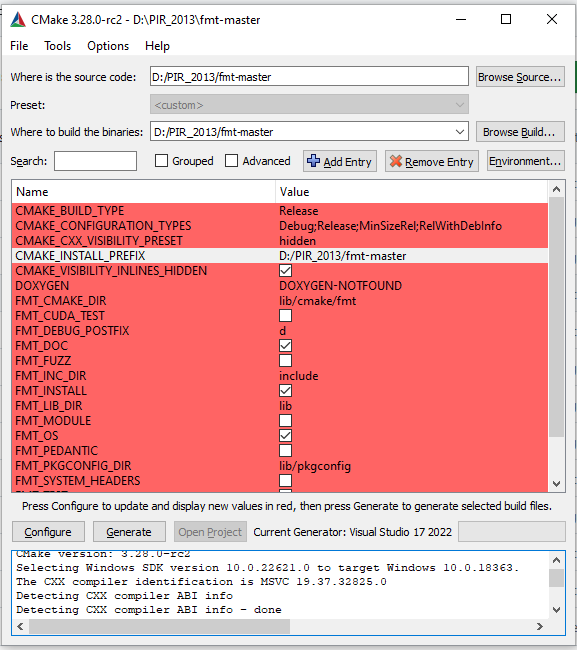

# Windows OpenImageIO

[**OpenImageIO**](openimageio.readthedocs.org)  

OpenImageIO is library for reading, writing, and processing images in a wide variety of file formats. Actually, we can follow [Installation instructions for OpenImageIO](https://github.com/AcademySoftwareFoundation/OpenImageIO/blob/master/INSTALL.md#installation-instructions-for-openimageio), in the next, I will give more detail how to install.

### Windows10

In windows,  [CMake](https://cmake.org/) and [Visual Studio IDE](https://visualstudio.microsoft.com/fr/vs/) is used for compile the project, we use [CMake 3.28](https://cmake.org/download/) and [Visual Studio 2022](https://visualstudio.microsoft.com/fr/vs/community/),  we can provide the pre-install files in Windows for download. After install CMake and Visual Studio IDE, make sure that C++ is install in  Visual Studio IDE. 

#### Boost

We use the version [**Boost 1.83.0**](https://www.boost.org/users/history/version_1_83_0.html), after download the zip, and run :

```
# cmd in boost directory 
bootstrap.bat
b2.exe
```

#### zlib

We use the version [**zlib-1.3**](https://www.zlib.net/), after download the zip, and use **CMake** to build the project :


Click on Configure, we set **x64**, and we set this for all the other project :


After generate the project, we use the Visual Studio IDE to compile the code, but we only need to complie the **static library** , but we can build the **INSTALL** to compile all the project :


#### libTIFF

We use the version [**tiff-4.6.0**](http://download.osgeo.org/libtiff/), after download the zip, and use **CMake** to build the project :


After generate the project, we build the **INSTALL** to compile all the project :


#### libjpeg

We use [**libjpeg-turbo**](https://libjpeg-turbo.org/), we can download the zip on [Github](https://github.com/libjpeg-turbo/libjpeg-turbo),  and use **CMake** to build the project :


After generate the project, we build the **INSTALL** to compile all the project :


#### libpng

Because for the image in the project, the format is all in **PNG**, so we need to make the  **OpenImageIO** support **PNG**, and **libpng** is mandatory. 

We use  the version [**lpng1640**](http://www.libpng.org/pub/png/libpng.html), after download the zip, and use **CMake** to build the project :


After generate the project, we build the **INSTALL** to compile all the project, but we only use the **png_static** :


#### Imath

we can download the zip on [Github](https://github.com/AcademySoftwareFoundation/Imath),  and use **CMake** to build the project :


After generate the project, we build the **INSTALL** to compile all the projec :


#### OpenEXR

Because during the CMake, we need to use [Git](https://gitforwindows.org/) to download the code, so we need to install **Git**.

we can download the zip on [Github](https://github.com/AcademySoftwareFoundation/Imath),  and use **CMake** to build the project :


After generate the project, we build the **INSTALL** to compile all the projec :


#### FMT

we can download the zip on [Github](https://github.com/fmtlib/fmt),  and use **CMake** to build the project :



After generate the project, we build the **fmt** to compile all the projec :


#### robin-map

we can download the zip on [Github](https://github.com/Tessil/robin-map),  and use **CMake** to build the project :


After generate the project, we build the **INSTALL** to compile all the projec :


#### OpenImageIO

we can download the zip on [Github](https://github.com/AcademySoftwareFoundation/OpenImageIO),  and use **CMake** to build the project :


We can compile the the two projects indivually :


The important thing is the project settings, (1) in order to support **PNG**, we need to check the pre-definition, there is **no DISABLE_PNG** : 


(2) for the Include directory, the setting is :


(3) for the library directory, the setting is :


(4) for the library name, the setting is : 


#### Pre-install files

For Windows, you can use the files, so that you do not need to do the compile the library **OpenImageIO**,  if you also use  [Visual Studio 2022](https://visualstudio.microsoft.com/fr/vs/community/).

**Include Files**

**Library Files**

**Link Files**

Setting in Visual Studio 2022

## MAINTENANCE
If you think you have any problem, contact [Teng Wu]<whuwuteng@gmail.com>